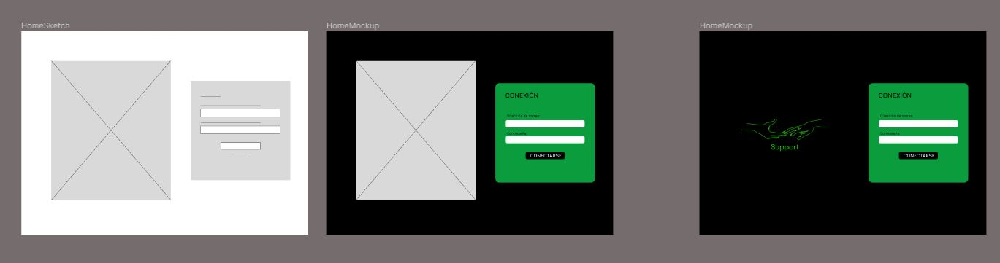
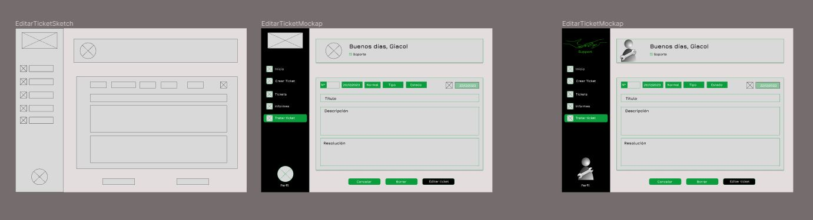

# Support-Project
Proyecto curso app para gestión de incidencias con Vue y Spring boot

## DISEÑO
<div align = "center">
&nbsp;
&nbsp;
&nbsp;
&nbsp;
</div>

## USER FLOW

<p align="center">
  
</p>


## DATABASE
<p align="center">
  
</p>

# Support-Project-Front

This template should help get you started developing with Vue 3 in Vite.

## Recommended IDE Setup

[VSCode](https://code.visualstudio.com/) + [Volar](https://marketplace.visualstudio.com/items?itemName=Vue.volar) (and disable Vetur) + [TypeScript Vue Plugin (Volar)](https://marketplace.visualstudio.com/items?itemName=Vue.vscode-typescript-vue-plugin).

## Customize configuration

See [Vite Configuration Reference](https://vitejs.dev/config/).

## Project Setup

```sh
npm install
```

### Compile and Hot-Reload for Development

```sh
npm run dev
```

### Compile and Minify for Production

```sh
npm run build
```

### Run Unit Tests with [Vitest](https://vitest.dev/)

```sh
npm run test:unit
```

